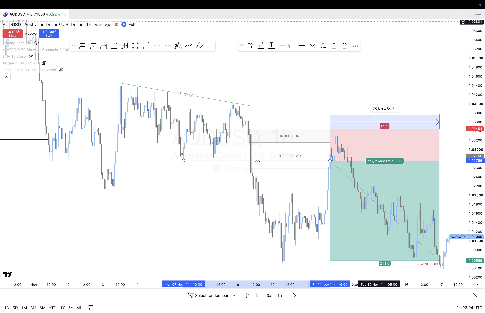

# Trend Continuation Example

This is the basic and simplest entry for this strategy.

---

## Reading the Market

1. The market is in a clear downtrend. But price has been efficient, with a lot of overlapping candle bars and wicks. It's a consistent downtrend with inconsistent inertia and low momentum, with a sloping resistance level appearing.

2. Then there is a break of structure. But not a normal one. This is a strong momentum candle that tears through and closes well beyond the previous swing low, printing a lower low. The market is still in the same downtrend, but this push down was atypical relative to prior market movement and momentum. It also left behind an indecision/doji candle.

3. Price then continues down without ever retracing to mitigate the inefficiency of the momentum candle. So on the larger retracement leg of the downtrend, price can be anticipated to retrace into that inefficiency or imbalance before pushing back down to continue the downtrend.

4. The entry is at the break of structure, in the middle of the inefficiency box. Price could also retrace deeper into the indecision candle, but entering at the break of structure is safer and more conservative. The stop loss goes just above the indecision block and the target is the most recent swing low.
