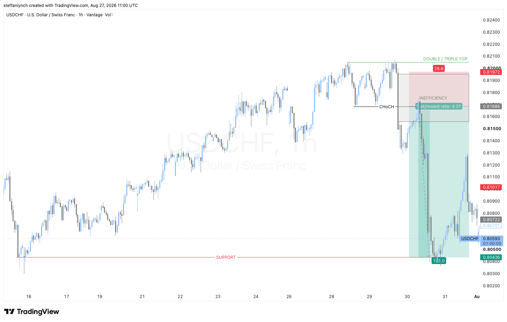

# Double Top Trend Reversal Example

This is the basic and simplest entry for this strategy.

---

## Reading the Market

1. The market is in a clear uptrend, over a substantial 12 day period (205 bars).

2. Then the trend slows - the double top. Price failed to make a higher high, which could indicate that the strength of buyers is slowing and even potentially a trend reversal (although it is too early to be sure, because the market could go sideways or pause briefly before continuing to print higher highs and continue the trend).

3. Then a strong bearish momentum candle tears through and closes below that previous swing low, creating a change of character. That is enough evidence to speculate that this is a trend reversal - the new change of character on top of the previously identified double top.

4. The next expectation is for the market to do one last "check" before continuing the bearish move. That "check" is the retest to enter on, which in this case was the price of the previous swing low. This was the last price at which it could be assumed that the majority of trades had been facilitated and the market was balanced.

5. The entry is at that change of character. The stop loss goes just above the boundary of the inefficiency box and the target is the previous support level.
