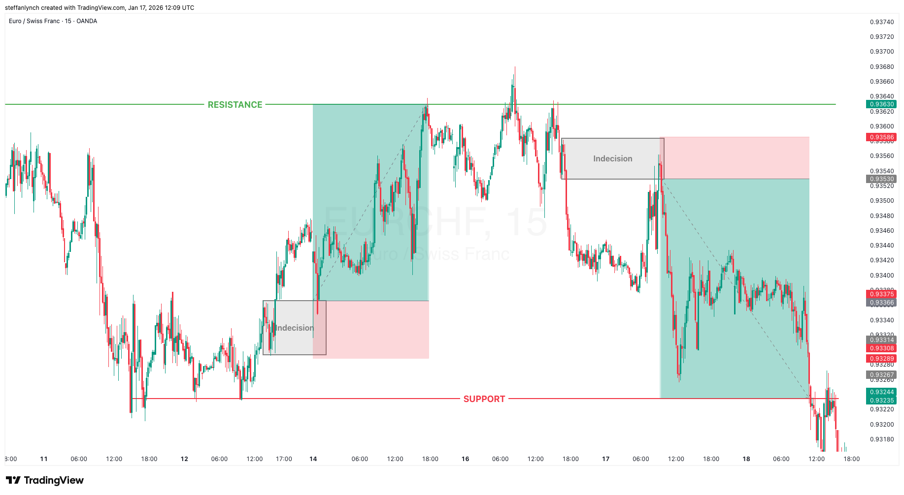

# Back to Back Opposite Trades

This is a beautiful example where we have two opposite trades back to back.

---

## Reading the Market

As always, we can see that there are clear support and resistance levels. If you look carefully, up until the far left where price breaks and closes below the support level, there is very choppy movement. In fact, we are actually in a ranging market. But luckily for us, there are still clear support and resistance levels.

It's hard to say who's really in control because there is no clear power or momentum from either side. They are both weakly playing ping pong with no sign of a clear winner.

So in this case, we just look to trade off of the rejections of the levels with no further confluence of momentum.

---

## Trade 1: The Buy

But this example shows something important. Zones of indecision will not always be one simple, clean doji candle. Sometimes it will be messy and unclear, especially in markets such as this.

But it's there. It's that first retracement from the extension off the support level.

**The setup:**
- Entry: Right at the tip of the indecision zone
- Stop loss: Barely below the bottom of the same zone
- Take profit: Targeting the opposite resistance level

Clean. Winning trade.

---

## Trade 2: The Sell

But then we are back at the resistance level and now sellers are in control (barely).

We see multiple attempts to push beyond the level, as expected, but failure to do so - printing a head and shoulders pattern.

**What does this mean?**
- Failure from buyers
- Strength from sellers
- Which ultimately means a reversal

So we are looking to sell.

There's the final rejection off the resistance level, with a moderately strong push, leaving our favourite doji candle there. Price pushes away, trickles back in.

**The setup:**
- Entry: At the indecision zone
- Stop loss: Above the zone
- Take profit: The opposite level of support this time

Price wicks into our entry and hits take profit.

---

## Key Takeaway

This example proves you don't need a strong trending market to find valid setups. Even in ranging, choppy conditions, if you have clear support and resistance levels, you can trade the rejections from both sides.
