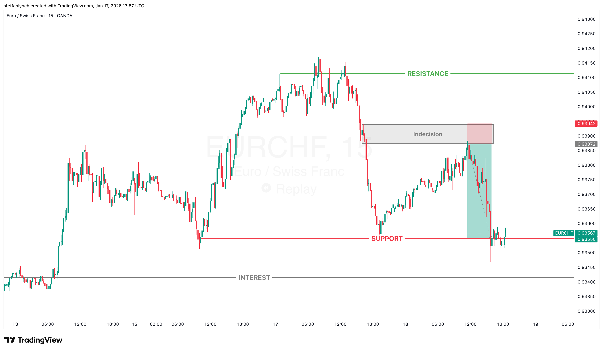

# Simple Sell Example

This is the basic and simplest entry for this strategy.

---

## Reading the Market

We can see that there are clear support and resistance levels. This boxes in price and helps us to focus and narrow our scope.

But the way price reacts to each level tells us a story:

1. **Buyers are strong pushing back up from the support level.** We see that because there is strong momentum.

2. **While the buyers are ultimately winning, the sellers are fighting back fairly strongly.** We can tell this because there are pretty deep and strong pullbacks in that temporary uptrend.

3. **As buyers get closer to the resistance level, momentum slows.** Direction shifts from upwards to sideways. A lot of choppy movement.

4. **Buyers consistently try to push beyond the resistance level but the sellers absorb the pressure** until finally they take control again with very little to no friction from buyers.

So we know we definitely want to be selling.

---

## The Entry

Lo and behold, we see our entry - a doji candle which indicates indecision. Very wicky candles. And then followed by a very strong continuation down, again with high momentum.

Price again hits the support, and buyers limp back up slowly into the supply zone.

**This is what we want:** A stronger push away from our entry zone while price trickles back in. This serves as more evidence that our bias is correct and sellers have the power in this price region.

---

## The Setup

- **Entry:** Right at the tip of the indecision zone
- **Stop loss:** Barely above the top of the same zone
- **Take profit:** Targeting the support level

**Why the stop loss placement?** Because at this point, if price gets above that supply zone, it almost proves that we were wrong about our short bias. At which point, we cut our losses.

---

## The Result

Price wicks into our indecision/supply zone before violently being pushed back down to hit our take profit.

Like always, the fact that price did not stay long in our entry zone is very good news and acts as more confluence for our trade. The longer price stays in our entry, the more likely it is to fail.
