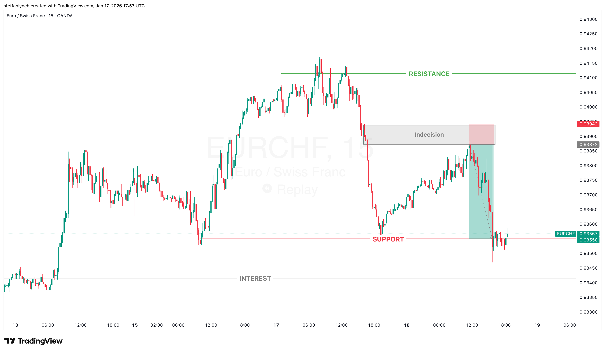

# Simple Sell Example

This is the basic and simplest entry for this strategy.

---

## Reading the Market

There are clear support and resistance levels. This boxes in price and helps to focus and narrow the scope.

But the way price reacts to each level tells a story:

1. **Buyers are strong, pushing back up from the support level.** That shows in the strong momentum.

2. **While the buyers are ultimately winning, the sellers are fighting back fairly strongly.** That shows in the pretty deep and strong pullbacks in that temporary uptrend.

3. **As buyers get closer to the resistance level, momentum slows.** Direction shifts from upwards to sideways. A lot of choppy movement.

4. **Buyers consistently try to push beyond the resistance level but the sellers absorb the pressure** until finally they take control again with very little to no friction from buyers.

So the bias is definitely to sell.

---

## The Entry

Then comes the entry - a doji candle which indicates indecision. Very wicky candles. Followed by a very strong continuation down, again with high momentum.

Price again hits the support, and buyers limp back up slowly into the supply zone.

**This is what is wanted:** A stronger push away from the entry zone while price trickles back in. This serves as more evidence that the bias is correct and sellers have the power in this price region.

---

## The Setup

- **Entry:** Right at the tip of the indecision zone
- **Stop loss:** Barely above the top of the same zone
- **Take profit:** Targeting the support level

**Why the stop loss placement?** Because at this point, if price gets above that supply zone, it almost proves that the short bias was wrong. At that point, the loss is cut.

---

## The Result

Price wicks into the indecision/supply zone before violently being pushed back down to hit the take profit.

Like always, the fact that price did not stay long in the entry zone is very good news and acts as more confluence for the trade. The longer price stays in an entry, the more likely it is to fail.
