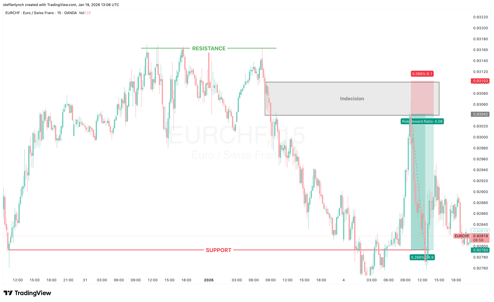

# Triple Top Sell Example

This is one of the strongest setups for this strategy.

---

## Reading the Market

We can see that there are clear support and resistance levels. But what stands out most is the resistance level.

Why? Because it's the triple top pattern.

**The triple top is evidence of failure.** Price tried three times to go higher… and failed every single time. That's a strong level of resistance.

It shows that buyers are trying to take price higher but there are too many sellers at that price point. This indicates that the sellers are more in control - which in turn is indicative of a trend reversal.

At which point, we want to enter and set our take profit all the way to the other side - which in our case here is the opposite support level.

---

## The Entry

On that last rejection of and push back against the level of resistance, we see our entry - a doji candle which indicates indecision. Very wicky candles. And then followed by a push continuing down.

Albeit, it's not the strongest push but it's enough momentum and clear enough direction for us to go off of.

---

## The Setup

- **Entry:** Right at the tip of the indecision zone
- **Stop loss:** Barely above the top of the same zone
- **Take profit:** Targeting the support level

**Why the stop loss placement?** Because at this point, if price gets above that supply zone, it almost proves that we were wrong about our short bias. At which point, we cut our losses.

---

## The Result

Price wicks into our indecision/supply zone before violently being pushed back down to hit our take profit.

The fact that price did not stay long in our entry zone is very good news and acts as more confluence for our trade. The longer price stays in our entry, the more likely it is to fail.

---

## Why This Setup is Strong

The triple top gives us extra confluence:

1. **Clear resistance level** - Price has been rejected here multiple times
2. **Evidence of exhaustion** - Buyers tried three times and couldn't break through
3. **Seller control** - Each failed attempt strengthens the case that sellers dominate this level
4. **High probability reversal** - Three failures is a strong signal that direction is about to change

When you combine the triple top pattern with a clean supply zone entry, you have a high-confidence trade.
