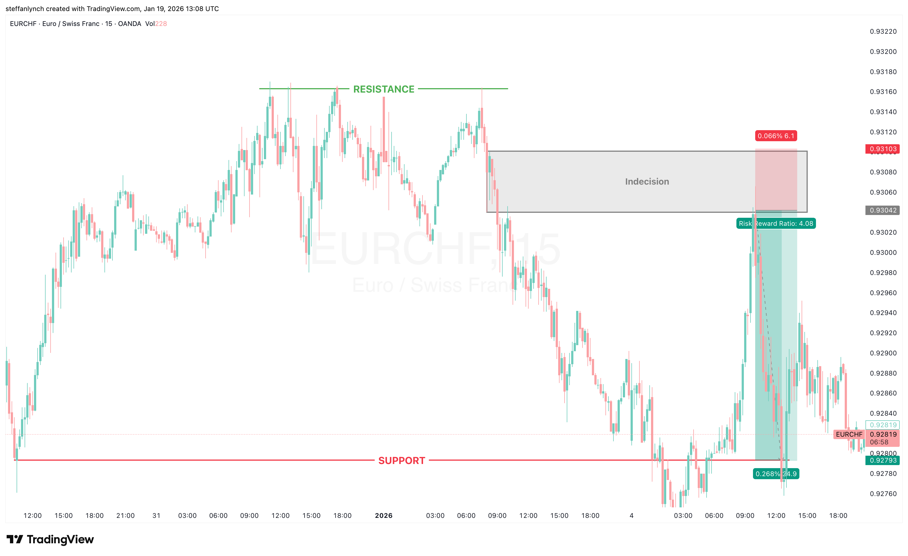

# Triple Top Sell Example

This is one of the strongest setups for this strategy.

---

## Reading the Market

There are clear support and resistance levels. But what stands out most is the resistance level.

Why? Because it's the triple top pattern.

**The triple top is evidence of failure.** Price tried three times to go higher… and failed every single time. That's a strong level of resistance.

It shows that buyers are trying to take price higher but there are too many sellers at that price point. This indicates that the sellers are more in control - which in turn is indicative of a trend reversal.

At that point, the trade is to enter and set the take profit all the way to the other side - which in this case is the opposite support level.

---

## The Entry

On that last rejection of, and push back against, the level of resistance comes the entry - a doji candle which indicates indecision. Very wicky candles. Then a push continuing down.

Albeit, it's not the strongest push but it's enough momentum and clear enough direction to go off.

---

## The Setup

- **Entry:** Right at the tip of the indecision zone
- **Stop loss:** Barely above the top of the same zone
- **Take profit:** Targeting the support level

**Why the stop loss placement?** Because at this point, if price gets above that supply zone, it almost proves that the short bias was wrong. At that point, the loss is cut.

---

## The Result

Price wicks into the indecision/supply zone before violently being pushed back down to hit the take profit.

The fact that price did not stay long in the entry zone is very good news and acts as more confluence for the trade. The longer price stays in an entry, the more likely it is to fail.

---

## Why This Setup is Strong

The triple top gives extra confluence:

1. **Clear resistance level** - Price has been rejected here multiple times
2. **Evidence of exhaustion** - Buyers tried three times and couldn't break through
3. **Seller control** - Each failed attempt strengthens the case that sellers dominate this level
4. **High probability reversal** - Three failures is a strong signal that direction is about to change

Combining the triple top pattern with a clean supply zone entry makes for a high-confidence trade.
